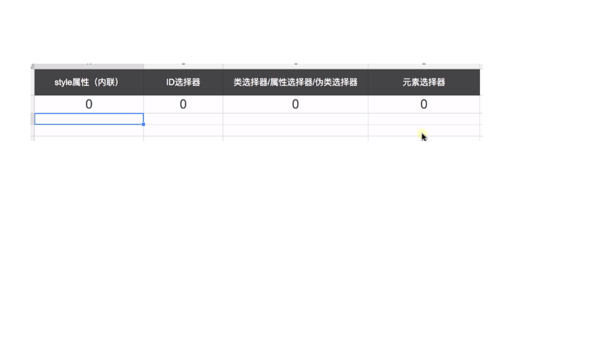

## 选择器分类
基本规则
>`seloctor{
        属性： 值；
    }`

* **ID选择器**
    1. 优先级权值最高;
    2. 语法示例
        >`#intro{ }` ，该规则选中 `id="intro"`的元素。
* **类选择器**
    1. 优先级权值比ID选择器低，比标签选择器高；
    2. 语法示例
        >`.intro{ }` ，该规则选中所有类名为 `class="intro"`的元素。

* **伪类选择器**
    1. 优先级权值与类选择器相同；
    2. 伪类选择器的类型
        * 链接伪类（按书写顺序排列）
            1. `:link` ：指定未被访问的链接的样式；
            2. `:visited` ：指定已被访问的链接的样式；
            * 动态（交互）伪类
            3. `:focus` ：指定链接被聚焦时的样式；
            4. `:hover` ：指定光标悬浮在链接元素时的样式；
            5. `:active` ：指定元素被激活时的样式。
        * 位置伪类
            1. `:nth-child(n)` / `:nth-last-child(n)` ：选择**作为第 n 个（反向）子元素**的元素；n 可取 `odd`、`even` ；
                * `:first-child` ：选择作为第一个子元素的元素；
                * `:last-child` ：选择作为最后一个子元素的元素；
            >**注意：**`p:first-child`选中的不是 p 的第一个子元素，而是作为第一个子元素的 p ；例如：`p:first-child`
            ```
            <div>
                <div></div>
                <p></p> <!--选中的不是这个 p -->
                <p></p>
                <div>
                    <p></p> <!--选中的是这个 p -->
                    <p></p>
                </div>
            </div> 
            ```     
            2. `:nth-of-type(n)` / `:nth-last-of-type(n)` ：选择**同层级的同类型的第 n 个（反向）元素**的元素；  
                * `:first-of-type` ：选择该类型元素的第一个元素；
                * `:last-last-of-type` ：选择该类型元素的最后一个元素；  
            >`:nth-child(n)`与`:nth-of-type(n)` 的区别：
            ```
            <div>  
                <div></div>
                <p></p> <!--p:nth-child(2)-->
                <p></p> <!--p:nth-of-type(2)-->
                <div>
                    <p></p> 
                    <p></p> <!--p:nth-of-type(2)-->
                </div>
            </div> 
            ```     
        * 取反伪类
            1. `:not(:not([value]))`
            2. `:not(p.a#b)`
* **属性选择器**
    1. 优先级权值与类选择器相同；
    2. 属性选择器的类型
        * 存在某属性
            * `[attr] {}`
        * 存在多个属性，chaining
            * `p[attr1][attr2]{}`
            * `[attr1][attr2]{}`
        * 属性名与值同时匹配
            * `p[attr="abc"]{}`
        * 属性值不区分大小写
            * `<a href=".PDF" i></a>`
        * 值以指定内容开头
            * `[attr^="abc"]{}` 
        * 值以指定内容结束
            * `[attr$='abc']{`
        * 值的任何位置包含指定内容
            * `[href*='.google.']{}`
        * 属性值前缀选择器
            * `[lang|='zh']{}`
* **标签选择器**
    1. 优先级权值最低；
    2. 以标签为选择器；
    3. 兄弟选择器和后代选择器
        * 兄弟选择器
            1. `A+B{}`：选择同一层级的紧跟在 `A` 后面的 `B`元素 ；
            2. `A~B{}`：选择同一层级的所有在 `A` 后面的 `B`类元素。
        * 后代选择器
            1. `A>B{}`：选择`A` 后面的直接子元素 `B`（即 `B` 是 `A` 的一代子元素）；
            2. `A B{}`：选择 `A` 后面所有后代 `B`类元素（即 `B` 可以是 `A` 的跨层级子元素）。
* **权重示意图(from right to left)**
    
        


